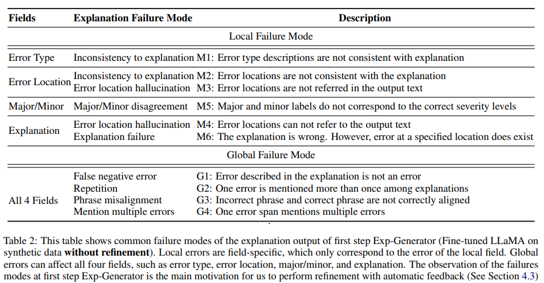

How can we more accurately and comprehensively evaluate text generation models?

Reading Time: About 10 minutes.

Paper：<https://arxiv.org/abs/2305.14282>

Code: <https://github.com/xu1998hz/InstructScore_SEScore3>

## Introduction
Text generation is a vital aspect of natural language processing (NLP), involving tasks like story generation, summarization, and dialogue systems. Evaluating these models has always been challenging, as traditional methods often lack interpretations of their predictions or fail to connect the scores to specific flaws in the generated text. Moreover, building interpretable models mimicking human evaluation often requires human-annotated data, which is scarce due to limited human resources and high annotation costs. INSTRUCTSCORE, a novel approach to evaluating text generation models, aims to bridge this gap by providing explainable feedback without relying on human-annotated data. This blog post delves into the mechanics of INSTRUCTSCORE and its implications for the NLP community.

<!--## INSTRUCTSCORE Overview
(INSTRUCTSCORE stands out by providing explainable, detailed feedback on the performance of text generation models. Unlike conventional evaluation metrics that offer a single score, INSTRUCTSCORE provides both a numerical score and a human readable diagnostic report, including error location, error type, severity level, and score justification. This allows developers and researchers to understand not just how well their model is performing, but also in which specific areas it excels or needs improvement.

The core idea behind INSTRUCTSCORE is to align the evaluation process more closely with human judgment. Traditional metrics like BLEU or ROUGE rely heavily on reference texts and can often miss the subtleties of human-like text generation. INSTRUCTSCORE, on the other hand, employs a more holistic approach, considering factors that are more aligned with human perceptions of quality and fluency in text.)-->

## Problem Definition
The objective of INSTRUCTSCORE is to develop an explainable metric model that not only predicts the quality score of candidate text in relation to a reference but also generates a diagnostic report in natural language. INSTRUCTSCORE evaluates the quality of a generated text (x) with respect to a reference (r) by producing a detailed diagnostic report. This report includes specifics about error location (l), error type (t), severity level (se), and explanation (e) associated with each identified error. This aligns the evaluation process more closely with human judgment, allowing developers and researchers to understand not just how well their model is performing, but also in which specific areas it excels or needs improvement. INSTRUCTSCORE comprises two main components: a score predictor and an explanation generator (Exp-Generator). The Exp-Generator is tasked with learning a function f: (x, r) → {(l, t, se, e)i}^n_i=1, which identifies n number of errors in the text. However, acquiring human-annotated mapping data for most text-generation tasks is challenging due to limited resources and high annotation costs. INSTRUCTSCORE addresses this by proposing a data construction method to automatically generate high-quality pseudo data for learning the function f.

## Methodology
The implementation of INSTRUCTSCORE unfolds in three key steps:

1. Knowledge Extraction: Gleaning explainable knowledge from a large-scale, instruction-following model (GPT-4) to guide the training of the Exp-Generator.
2. Diagnostic Analysis: Evaluating diagnostic reports to pinpoint failure modes and utilizing GPT-4 feedback to generate alignment scores, which aid in identifying the most precise diagnostic reports.
3. Refinement: Employing the chosen reports to fine-tune the Exp-Generator, thereby improving its accuracy and reliability.

<!--Overall, the process consists of the following steps:

1. Extracting explainable knowledge from a large-scale, instruction-following model to train the Exp-Generator.
2. Analyzing the generated diagnostic reports to identify failure modes, and converting feedback from GPT-4 into alignment scores, guiding the selection of the most accurate diagnostic reports.
3. Fine-tuning Exp-Generator using selected reports, refining its output for enhanced accuracy and reliability.-->
<!--3. The generated diagnostic reports are then analyzed to identify common failure modes, which are further feedbackevaluated by GPT-4. Feedback from GPT-4 is converted into alignment scores, guiding the selection of the most accurate diagnostic reports.-->

### Explanation Synthesis
In this step, GPT-4 is leveraged to extract representative explainable knowledge that can greatly contribute to the subsequent Exp-Generator learning process. Given a carefully designed prompt specifying the number of errors, error types, and severity labels, GPT-4 is used to construct a candidate output with the specified error descriptions and an explanation for this error annotation.

In cases where the evaluation task involves multiple aspects, different error types are allocated to each specific dimension. To reduce the model's dependence on the lexical and structural similarities between the generated text and the original, we direct GPT-4 to rephrase the original text, thus creating a pseudo-reference sentence. This procedure creates synthetic data that demonstrates the relationship between the variables (x, y) and (t, l, se, e).

The Exp-Generator is trained using this specially constructed data. We utilized LLaMA for the Exp-Generator due to its open-source availability and its efficacy in both comprehension and generation tasks. The training involves feeding the Exp-Generator with the pseudo-reference (y) and the candidate text (x) as inputs, and it outputs a diagnostic report detailing the error type (t), location (l), severity (se), and explanation (e). An illustrative example of this can be seen in Figure 2. The training objective is mathematically formulated as L(t, l, se, e, x, y) = − log P(t, l, se, e|y, x; θ), where θ represents the trainable parameters of the Exp-Generator.

### Auto-Identifying Failure Modes of Metric Output
The diagnostic report plays a crucial role in text quality explanations. However, it's recognized that the model might not always produce accurate explanations, leading to what are termed failure modes. These failure modes are classified into two categories: global and local as shown in table 2. Global failures affect all four fields of the diagnostic report - error type, location, major/minor classification, and explanation - while local failures impact only one specific field.

Table 3 demonstrates one failure mode M4:

Identifying the failure modes ideally would require human annotation but is not feasible for every instance. Instead, GPT-4’s capabilities in information extraction, parsing, and semantic understanding are leveraged to transform complex queries into simpler yes/no questions, aiding in the identification of these failure modes. Here is a detailed example of the prompt query for checking M1-M6 and G1-G4:

To illustrate, GPT-4 is prompted to dissect the explanations into pairs of incorrect and correct phrases and identify the error span within the text. This process helps in verifying the accuracy of error locations and explanations and identifying instances of multiple errors within a single location. The identified failure modes are then translated into alignment scores, providing a quantitative measure of the diagnostic report's accuracy.

For example, if a report has four error annotations, each with four fields: error type, location, severity level (major/minor), and explanation, 16 fields in total. If one global plus one local failure mode is observed, the alignment score would be 11/16. This structured approach allows for a detailed and systematic evaluation of the diagnostic report's accuracy, enhancing the reliability of INSTRUCTSCORE's text quality assessments.

### Refinement with Meta-Feedback
The alignment scores generated by GPT-4 are used to further fine-tune the Exp-Generator. Specifically, the model input can be expressed as hypothesis h_i with reference k_i. For each input pair (h_i, k_i), the model employs top p sampling to sample multiple potential diagnostic outputs, labeled as {o1, o2, ..., on}. The diagnostic output that yields the best alignment score, as determined by GPT-4's feedback, is then selected for further refinement of the Exp-Generator. This output, denoted as o_aligned = {t_aligned, l_aligned, se_aligned, e_aligned}, is used to fine-tune the Exp-Generator, enhancing its ability to produce accurate diagnostic reports.

This self-training and automatic critique pipeline is designed to improve the accuracy of the diagnostic reports. By aligning these reports more closely with human evaluation, the model aims to reduce failure modes and achieve better alignment with human judgments. The refinement process is mathematically defined as L(o_aligned, x, y) = − log P(o_aligned|y, x; θ), where θ represents the trainable parameters of the Exp-Generator.

## Experiment
### Research Questions and Setup
Our experiments aimed to address six key research questions, focusing on INSTRUCTSCORE's performance across various tasks, domains, evaluation dimensions, unseen tasks, effectiveness in languages other than English, and alignment with human expectations. We tested INSTRUCTSCORE on tasks including machine translation (WMT22), table-to-text (WebNLG), captioning (Flicker3k), keyword-to-text (BAGEL), and commonsense text generation (Commongen). Additionally, we assessed its performance in different domains within the WMT22 task, evaluated it across various dimensions in WebNLG, and explored its capabilities in unseen tasks and languages.
### Implementation and Evaluation
We used GPT-4 as our base for implicit evaluation knowledge and LLaMA-7B for training initialization. Our data set, drawn from diverse domains, was utilized to tailor the model to specific task domains. We defined four evaluation scenarios and trained separate checkpoints for each, ensuring coverage of diverse text domains. The performance of INSTRUCTSCORE was assessed using Segment-level Kendall and Pearson correlations (should I introduce each of them??) between human and metric outputs. Human annotators were employed to assess the alignment of our model before and after refinement, evaluating based on predefined failure mode criteria.
### Main Results
INSTRUCTSCORE showed robust performance across various tasks and domains. It significantly outperformed all other unsupervised metrics in 8 out of 9 tasks and was on par with or even surpassed some supervised metrics that trained over direct assessment data (DA).

It also surpassed all unsupervised metrics in all domains except GPT-3.5 and GPT-4 baselines in the Chat domain. However, in the News domain, its performance lagged behind SOTA metrics like COMET22 and Metric-XXL, likely due to these models' specialized training on supervised data tailored for news content. <!--This gap can be attributed to the supervised data distribution in these models, specifically tailored for the News domain. -->

Furthermore, INSTRUCTSCORE outperformed all unsupervised learned metrics and even besting BLEURT in three out of five dimensions. This highlights its capability for nuanced, multi-dimensional evaluation of NLG tasks. 

Additionally, INSTRUCTSCORE demonstrated strong generalizability to new tasks with unseen data formats and criteria, as evidenced by its performance on the BAGEL benchmark. It achieved higher correlations than BLEURT and excelled in two of three new evaluation dimensions, underscoring its adaptability to diverse and novel NLG tasks.

### Quantitative Analysis
#### Non-English Language Performance
INSTRUCTSCORE showed solid performance in English-to-German translation, but it didn't surpass the 175B GPT3.5 models or supervised metrics like COMET22 and BLEURT20. This could be due to limited pretraining in non-English languages and the need for language alignment in mixed code text generation.

#### Impact of Automatic critique and Self-training
The human evaluation assessed INSTRUCTSCORE's alignment both before and after self-training. Our experiments demonstrats significant reductions in both global and local failure modes. Notably, global failures saw a dramatic decrease of over 50%, highlighting substantial improvements in phrase alignment, error identification, and formatting. The decrease in local failures further demonstrates improved consistency across the four evaluated fields.<!--Consistency across the four evaluated fields also improved, as evidenced by advancements in all M occurrences.--> While there was a minor uptick in one type of local failure (M6), this was linked to the conversion of some global failures into local ones, indicating a shift rather than a setback in model accuracy.

Importantly, these refinements led to a 0.106 absolute gain (13.7% improvement) in human alignment scores, maintaining consistent performance in both Kendall and Pearson correlations. This enhancement indicates that INSTRUCTSCORE after our refinements is more aligned with human evaluators' assessments.

Precision and recall of its annotations also improved markedly, with a 11.6% increasement of precision and 3.2% improvement in recall.
<!--, with the precision of explanations increasing from 75.6% to 86.1%, and recall from 81.9% to 85.0%.-->

<!--### Summary
The experiments highlighted INSTRUCTSCORE's proficiency in delivering precise and comprehensive evaluations for various natural language generation tasks. Its adaptability across multiple domains and tasks, along with enhanced alignment with human expectations, underscores its value as a flexible and dependable assessment instrument in NLP. Notably, the refinement through automatic feedback has achieved a closer correspondence with human standards, enhancing its effectiveness.-->

## Future Improvements
<!--While INSTRUCTSCORE represents a significant advancement in text generation evaluation, it is not without limitations. The complexity of the evaluation process means that it may require more resources and time compared to traditional methods. Additionally, the reliance on human judgment for certain aspects of the evaluation could introduce subjectivity into the process.-->

### Expanding Multilingual Evaluation Capabilities
Given the current limitation of using English instructions for evaluations in other languages, we plan to enhance the model's capabilities in mixed code generation and multilingual word alignment. This will involve exploring advanced pretraining and warm-up techniques to adapt more effectively to multilingual contexts.

### Investigating the Impact of Model Size
Our current computational resources limit the ability to fully explore how model size affects performance. Future research will delve into the scaling law of model sizes to understand how larger models might influence INSTRUCTSCORE's performance, particularly in reducing failure modes.

### Refinement Process Enhancement
While the current refinement process has proved efficient in aligning INSTRUCTSCORE with human judgments, there's room for improvement. Future studies will explore more advanced techniques, such as incorporating human feedback through reinforcement learning. This approach aims to integrate feedback more effectively into the training pipeline, potentially enhancing the overall performance and accuracy of INSTRUCTSCORE.

## Conclusion
INSTRUCTSCORE is a promising development in the field of NLP, offering a more nuanced and detailed way to evaluate text generation models. Its focus on explainability and fine-grained feedback not only aids in model development but also contributes to our understanding of natural language processing. As the field of AI continues to evolve, approaches like INSTRUCTSCORE will be crucial in bridging the gap between human and machine-generated text.

We've introduced INSTRUCTSCORE, a novel framework for explainable text generation evaluation, effectively addressing the limitations of current black-box metrics. Our approach, which regularizes explanations through defined failure modes, has demonstrated impressive adaptability across various domains, tasks, and dimensions, surpassing other general metrics. Notably, the refinement process utilizing automatic feedback significantly improved human alignment, precision, and recall by 13.7%, 11.6%, and 3.2%, respectively, ensuring closer alignment with human evaluations. Committed to supporting further research, we've made INSTRUCTSCORE publicly available and open-sourced all related data and codes.

## References
[1] W. Xu et al., “INSTRUCTSCORE: Towards explainable text generation evaluation with automatic feedback,” Proceedings of the 2023 Conference on Empirical Methods in Natural Language Processing, 2023. doi:10.18653/v1/2023.emnlp-main.365 

