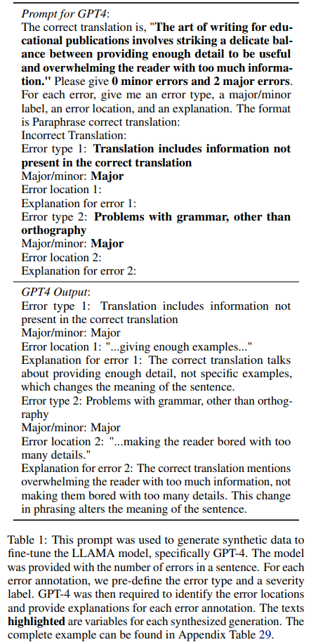
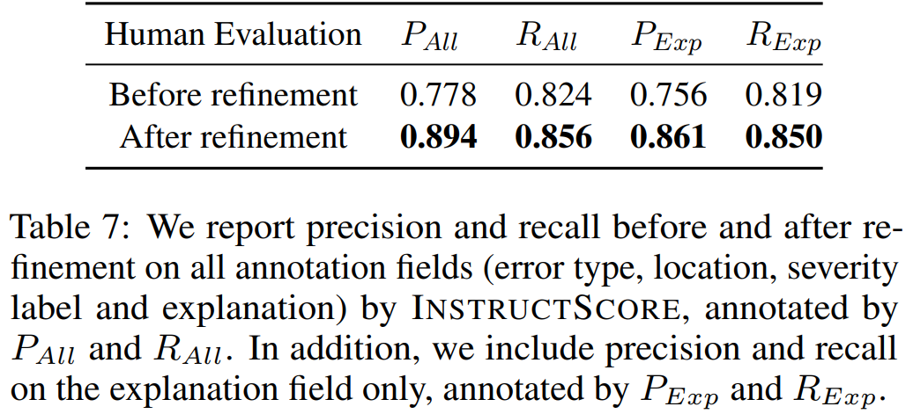

How can we more accurately and comprehensively evaluate text generation models?

Reading Time: About 10 minutes.

Paper：<https://arxiv.org/abs/2305.14282>

Code: <https://github.com/xu1998hz/InstructScore_SEScore3>

## Introduction

Text generation is a vital aspect of natural language processing (NLP), involving tasks like story generation, summarization, and dialogue systems. Evaluating these models has always been challenging, as traditional methods often lack interpretations of their predictions or fail to connect the scores to specific flaws in the generated text. For example, metrics like BLEU and TER focus on surface form differences and often do not align with human judgment, while recent learned metrics such as BERTScore, BLEURT, COMET, and SEScore show better correlation with human evaluations but offer only a single numerical score without explaining the rationale behind these scores or identifying specific defects in the text. Moreover, building interpretable models mimicking human evaluation often requires human-annotated data, which is scarce due to limited human resources and high annotation costs. 

To address this gap, the paper introduces INSTRUCTSCORE, a novel method for developing an explainable text generation metric without relying on human-annotated data. INSTRUCTSCORE aims to provide a fine-grained, explanation-based evaluation by pinpointing concrete error locations, identifying error types, assigning severity labels, and justifying the final score through both numerical values and natural language explanations. This is achieved by extracting latent evaluation knowledge from models like GPT-4 to create a synthetic dataset with structured explanations, identifying explanation failure modes, and refining the model based on automated feedback to optimize alignment with human judgment.

The advent of a learned and explainable metric like INSTRUCTSCORE marks a pivotal advancement in natural language processing, emphasizing the critical need for transparency and targeted improvement in automated text evaluation. INSTRUCTSCORE's transparency allows developers to pinpoint and address specific model weaknesses directly, fostering trust in automated evaluations and enabling more efficient model refinements. Moreover, by offering detailed feedback without relying on scarce human-annotated data, INSTRUCTSCORE can easily scale and adapt to new domains, enriching educational resources and spurring research into the nuanced aspects of language generation. <!--In essence, the introduction of explainable metrics not only propels the development of more sophisticated and user-aligned NLP applications but also deepens our understanding of the complex interplay between machine-generated text and human perception, marking a significant leap toward achieving truly human-like text evaluation and generation capabilities.-->

<!--INSTRUCTSCORE, a novel approach to evaluating text generation models, aims to bridge this gap by providing explainable feedback without relying on human-annotated data. This blog will delve into the mechanics of INSTRUCTSCORE and its implications for the NLP community.-->

Here is an example of INSTRUCTSCORE's input and outputs before and after refinement.

## Problem Definition

The objective of INSTRUCTSCORE is to develop an explainable metric model that not only predicts the quality score of candidate text in relation to a reference but also generates a diagnostic report in natural language. INSTRUCTSCORE evaluates the quality of a generated text (x) with respect to a reference (r) by producing a detailed diagnostic report. This report includes specifics about error location (l), error type (t), severity level (se), and explanation (e) associated with each identified error. This aligns the evaluation process more closely with human judgment, allowing developers and researchers to understand not just how well their model is performing, but also in which specific areas it excels or needs improvement. INSTRUCTSCORE comprises two main components: a score predictor and an explanation generator (Exp-Generator). The Exp-Generator is tasked with learning a function f: (x, r) → {(l, t, se, e)i}^n_i=1, which identifies n number of errors in the text. However, acquiring human-annotated mapping data for most text-generation tasks is challenging due to limited resources and high annotation costs. INSTRUCTSCORE addresses this by proposing a data construction method to automatically generate high-quality pseudo data for learning the function f.

## Methodology

The implementation of INSTRUCTSCORE unfolds in three key steps:

1. Explanation Synthesis and Instruction Finetuning: Gleaning explainable knowledge from a large-scale, instruction-following model (GPT-4) to guide the training of the Exp-Generator.
2. Diagnostic Analysis: Evaluating diagnostic reports to pinpoint failure modes and utilizing GPT-4 feedback to generate alignment scores, which aid in identifying the most accurate diagnostic reports.
3. Refinement: Employing the chosen reports to further fine-tune the Exp-Generator, thereby improving its accuracy and reliability.

<!--Overall, the process consists of the following steps:

1. Extracting explainable knowledge from a large-scale, instruction-following model to train the Exp-Generator.
2. Analyzing the generated diagnostic reports to identify failure modes, and converting feedback from GPT-4 into alignment scores, guiding the selection of the most accurate diagnostic reports.
3. Fine-tuning Exp-Generator using selected reports, refining its output for enhanced accuracy and reliability.-->
<!--3. The generated diagnostic reports are then analyzed to identify common failure modes, which are further feedbackevaluated by GPT-4. Feedback from GPT-4 is converted into alignment scores, guiding the selection of the most accurate diagnostic reports.-->

### Explanation Synthesis and Instruction Finetuning

In this step, GPT-4 is leveraged to extract representative explainable knowledge that can greatly contribute to the subsequent Exp-Generator learning process. We compile a diverse corpus of sentences across various domains, which serves as the foundation for error injection. GPT-4 is then prompted with specified number of errors, error types, and severity labels to synthesize a candidate output with the specified error descriptions and an explanation for this error annotation. This method ensures a rich dataset reflective of the intricate relationship between the generated text, the reference, and the identified errors, thereby facilitating the training of our Exp-Generator. 

In cases where the evaluation task involves multiple aspects, different error types are allocated to each specific dimension. To reduce the model's dependence on the lexical and structural similarities between the generated text and the original, we direct GPT-4 to rephrase the original text, thus creating a pseudo-reference sentence. This procedure creates synthetic data that demonstrates the relationship between the variables (x, y) and (t, l, se, e).

The Exp-Generator is trained using this specially constructed data. We utilized LLaMA for the Exp-Generator due to its open-source availability and its efficacy in both comprehension and generation tasks. The training involves feeding the Exp-Generator with the pseudo-reference (y) and the candidate text (x) as inputs, and it outputs a diagnostic report detailing the error type (t), location (l), severity (se), and explanation (e). An illustrative example of this can be seen in Figure 2. The training objective is mathematically formulated as L(t, l, se, e, x, y) = − log P(t, l, se, e|y, x; θ), where θ represents the trainable parameters of the Exp-Generator.

###  Diagnostic Analysis -- Auto-Identifying Failure Modes of Metric Output

The diagnostic report plays a crucial role in text quality explanations. However, it's recognized that the model might not always produce accurate explanations, leading to what are termed failure modes. These failure modes are classified into two categories: global and local as shown in table 2. Global failures affect all four fields of the diagnostic report - error type, location, severity level, and explanation - while local failures impact only one specific field. Six scenarios M1-M6 for local failures and four scenarios G1-G4 for global failures are defined in table 2. A particular scenario arises when the method produces an annotation indicating the absence of errors. In such instances, we prompt GPT-4 to verify whether the output contains any error. If errors actually exist, the diagnostic report would be rendered inaccurate.

Table 3 demonstrates one failure mode M4, where error locations in explanation can not refer to the output text. The phrase "whole family loves reading" does not appear in the generated text; rather, it is found in the reference text.

Identifying the failure modes ideally would require human annotation but is not feasible for every instance. Instead, GPT-4’s capabilities in information extraction, parsing, and semantic understanding are leveraged to transform complex queries into simpler yes/no questions, aiding in the identification of these failure modes. Here is a detailed example of the prompt query for checking M1-M6 and G1-G4:

To illustrate, GPT-4 is prompted to dissect the explanations into pairs of incorrect and correct phrases and identify the error span within the text. This process helps in verifying the accuracy of error locations and explanations and identifying instances of multiple errors within a single location. The identified failure modes are then translated into alignment scores, providing a quantitative measure of the diagnostic report's accuracy. To tackle the issues of hallucinated error locations (M3) and explanations (M4), we ensure the identified error spans are actually referenced within the candidate sentence. When an error annotation comprises multiple pairs of incorrect and correct phrases, it suggests the presence of several errors within a single location (G4). In addressing G1, our initial step is to ascertain whether the marked incorrect phrase truly constitutes an error. We also confirm whether the suggested revision is incorporated into the output. For addressing the remaining M and G categories, we craft specialized prompt queries directed at GPT-4. 

Upon receiving feedback on local and global failure modes from GPT-4, we translate this feedback into alignment scores, applying a binary scoring system to each diagnostic output field. Specifically, a local error detection results in a zero score for its respective field, whereas a global error detection leads to zero scores across all four fields associated with that error annotation. Consequently, the overall score of a diagnostic report is calculated as the ratio of correctly identified fields to the total number of fields, resulting in an alignment score ranging from 0 to 1. For instance, consider a candidate sentence annotated with four errors, encompassing four fields each: error type, location, severity (major/minor), and explanation, summing up to 16 fields in total. Should there be one global error and one local error identified, the alignment score assigned would be 11/16. This structured approach allows for a detailed and systematic evaluation of the diagnostic report's accuracy, enhancing the reliability of INSTRUCTSCORE's text quality assessments.

### Refinement with Meta-Feedback

The alignment scores generated by GPT-4 are used to further fine-tune the Exp-Generator. Specifically, the model input can be expressed as hypothesis h_i with reference k_i. For each input pair (h_i, k_i), the model employs top p sampling to sample multiple potential diagnostic outputs, labeled as {o1, o2, ..., on}. The diagnostic output that yields the best alignment score, as determined by GPT-4's feedback, is then selected for further refinement of the Exp-Generator. This output, denoted as o_aligned = {t_aligned, l_aligned, se_aligned, e_aligned}, is used to fine-tune the Exp-Generator, enhancing its ability to produce accurate diagnostic reports.

This self-training and automatic critique pipeline is designed to improve the accuracy of the diagnostic reports. By aligning these reports more closely with human evaluation, the model aims to reduce failure modes and achieve better alignment with human judgments. The refinement process is mathematically defined as L(o_aligned, x, y) = − log P(o_aligned|y, x; θ), where θ represents the trainable parameters of the Exp-Generator.

## Experiment

### Research Questions and Setup

Our experiments aimed to address six key research questions, focusing on INSTRUCTSCORE's performance across various tasks, domains, evaluation dimensions, unseen tasks, effectiveness in languages other than English, and alignment with human expectations. We tested INSTRUCTSCORE on tasks including machine translation (WMT22), table-to-text (WebNLG), captioning (Flicker3k), keyword-to-text (BAGEL), and commonsense text generation (Commongen). Additionally, we assessed its performance in different domains within the WMT22 task, evaluated it across various dimensions in WebNLG, and explored its capabilities in unseen tasks and languages.

### Implementation and Evaluation

We used GPT-4 as our base for implicit evaluation knowledge and LLaMA-7B for training initialization. Our data set, drawn from diverse domains, was utilized to tailor the model to specific task domains. We defined four evaluation scenarios and trained separate checkpoints for each, ensuring coverage of diverse text domains. The performance of INSTRUCTSCORE was assessed using Segment-level Kendall and Pearson correlations between human and metric outputs. Human annotators were employed to assess the alignment of our model before and after refinement, evaluating based on predefined failure mode criteria.

### Results

#### 1) What is the performance across various tasks within the English language?

For this task, we tested INSTRUCTSCORE at various tasks, including WMT22 (Machine Translation), WebNLG (Table-to-text), Flicker3k (Captioning), BAGEL (Keyword-to-text) and Commongen (Commonsense text generation). <!--INSTRUCTSCORE showed robust performance across various tasks and domains. It significantly outperformed all other unsupervised metrics in 8 out of 9 tasks and was on par with or even surpassed some supervised metrics that trained over direct assessment data (DA).--> Table 5 demonstrates that INSTRUCTSCORE considerably surpasses all other unsupervised metrics in eight out of nine categories, securing the highest overall ranking. These enhancements are statistically validated through William’s pairwise significance test, with a p-value less than 0.05, underscoring their reliability. Remarkably, INSTRUCTSCORE also exceeds the performance of previously established supervised metrics that were trained using direct assessment data (DA), outperforming BLEURT20 in six out of nine categories. When compared to the GPT4 baseline, INSTRUCTSCORE shows superior performance against GEMBA-GPT4, with improvements of 0.021 in Kendall and 0.145 in Pearson correlation coefficients. The notable difference in Pearson correlation is attributed to a significant number of ties generated by GEMBA-GPT4, which may influence the accuracy of Kendall correlation results. Furthermore, INSTRUCTSCORE demonstrates competitive performance relative to supervised metrics like MATESE, COMET22, and Metric XXL, which were trained using extensive human rating data (DA and MQM), with an average gap of 0.012 in Kendall correlation and 0.045 in Pearson correlation.

#### 2) What is the performance across different domains within the same task?

For this question, we examed our method at four diverse domains: News, Conversation, Social, and E-Commerce at WMT22. Through Kendall correlation analysis, INSTRUCTSCORE excels beyond all unsupervised metrics in four domains, with exceptions being the GPT-3.5 and GPT-4 baselines in the Chat domain. It showcases performance on par with leading supervised metrics COMET22 and Metric-XXL in the E-commerce, Chat, and Social domains. However, INSTRUCTSCORE falls short in the News domain when compared to the state-of-the-art metrics COMET22 and Metric-XXL. This discrepancy is largely due to their specialized data distribution for the News domain, derived from direct assessment (DA) and multi-dimensional quality metrics (MQM) data.

#### 3) What is the performance across different evaluation dimensions?

We evaluated INSTRUCTSCORE at five evaluation dimensions at WebNLG. Unlike the majority of metrics that provide a single score, INSTRUCTSCORE delivers a nuanced evaluation by outputting scores across multiple dimensions. Figure 4 illustrates INSTRUCTSCORE's superior performance over all unsupervised metrics across five distinct dimensions. When compared with BLEURT, which is trained on WebNLG human rating data, INSTRUCTSCORE surpasses BLEURT's best performance in three out of five evaluation dimensions. This highlights INSTRUCTSCORE's capability not only to offer a comprehensive quality score but also to facilitate a multidimensional evaluation of natural language generation tasks.

#### 4) What is the performance at unseen tasks?

Here we evaluated our method at BAGEL benchmark, a task characterized by its distinct data formats and criteria divergent from our training dataset. As illustrated in Table 5 and Figure 5, INSTRUCTSCORE, despite its unfamiliarity with the evaluation criteria specific to keyword-to-text generation, achieves higher Kendall and Pearson correlation scores than BLEURT, alongside outperforming in two out of three novel evaluation dimensions.

#### 5) Given that LLaMA is predominantly trained in English texts, can it effectively evaluate generations in other languages?

We evaluated our approach to English-to-German translations in order to investigate its multilingual evaluation capabilities. n Figure 6, INSTRUCTSCORE surpasses the majority of unsupervised metrics but falls short of the 175B GPT3.5 models and supervised metrics like COMET22 and BLEURT20 in the WMT22 English-to-German translation task. We theorize that the performance of LLaMA on non-English texts is influenced by several factors: (1) a limited amount of pretraining data, leading to less robust pretrained knowledge for languages other than English, and (2) the necessity for language alignment in tasks involving mixed-code text generation. These challenges suggest areas for future research, including the development of multilingual alignment warm-up methods prior to training on evaluation datasets 

#### 6) Can we align the diagnostic report with human expectations without requiring extensive human efforts?

We conduct human evaluation to assess our metric’s alignment before and after self-training. The evaluation detail for human rators are shown in table 8.

The human evaluation assessed INSTRUCTSCORE's alignment both before and after self-training. As depicted in Figure 7, INSTRUCTSCORE, following automatic critique and refinement, notably reduces the majority of global and local failure modes. Noteworthy is the more than 50% reduction in all global failure occurrences, illustrating significant enhancements in phrase alignment, error identification, and formatting consistency across the four fields. An observed slight increase in M6 failures is attributed to the reclassification of some global failures as local. Table 6 reveals that INSTRUCTSCORE achieves a 0.106 absolute gain in human scores, maintaining comparable performance in both Kendall and Pearson correlations. 

The process also significantly improves the precision and recall of INSTRUCTSCORE’s annotations, as verified through human evaluation involving three annotators. Precision, defined as the number of correctly annotated error fields divided by the total number of error fields labeled by INSTRUCTSCORE, and recall, the number of correctly annotated fields over the sum of these plus missed error fields, both saw substantial improvements post-refinement. Specifically, precision increased by 11.6% and recall by 3.2%, with the refinement process notably enhancing explanation precision from 75.6% to 86.1% and recall from 81.9% to 85.0%. These improvements underscore that 89.4% of INSTRUCTSCORE’s output post-refinement is accurate, and it successfully identifies 85.6% of errors, showcasing the effectiveness of the automatic critique and self-training in elevating INSTRUCTSCORE’s evaluation accuracy.

## Future Improvements

<!--While INSTRUCTSCORE represents a significant advancement in text generation evaluation, it is not without limitations. The complexity of the evaluation process means that it may require more resources and time compared to traditional methods. Additionally, the reliance on human judgment for certain aspects of the evaluation could introduce subjectivity into the process.-->

### Expanding Multilingual Evaluation Capabilities

Given the current limitation of using English instructions for evaluations in other languages, we plan to enhance the model's capabilities in mixed code generation and multilingual word alignment. This will involve exploring advanced pretraining and warm-up techniques to adapt more effectively to multilingual contexts.

### Investigating the Impact of Model Size

Our current computational resources limit the ability to fully explore how model size affects performance. Future research will delve into the scaling law of model sizes to understand how larger models might influence INSTRUCTSCORE's performance, particularly in reducing failure modes.

### Refinement Process Enhancement

While the current refinement process has proved efficient in aligning INSTRUCTSCORE with human judgments, there's room for improvement. Future studies will explore more advanced techniques, such as incorporating human feedback through reinforcement learning. This approach aims to integrate feedback more effectively into the training pipeline, potentially enhancing the overall performance and accuracy of INSTRUCTSCORE.

## Conclusion

INSTRUCTSCORE is a promising development in the field of NLP, offering a more nuanced and detailed way to evaluate text generation models. Its focus on explainability and fine-grained feedback not only aids in model development but also contributes to our understanding of natural language processing. As the field of AI continues to evolve, approaches like INSTRUCTSCORE will be crucial in bridging the gap between human and machine-generated text.

We've introduced INSTRUCTSCORE, a novel framework for explainable text generation evaluation, effectively addressing the limitations of current black-box metrics. Our approach, which regularizes explanations through defined failure modes, has demonstrated impressive adaptability across various domains, tasks, and dimensions, surpassing other general metrics. Notably, the refinement process utilizing automatic feedback significantly improved human alignment, precision, and recall by 13.7%, 11.6%, and 3.2%, respectively, ensuring closer alignment with human evaluations. Committed to supporting further research, we've made INSTRUCTSCORE publicly available and open-sourced all related data and codes.

## References

[1] W. Xu et al., “INSTRUCTSCORE: Towards explainable text generation evaluation with automatic feedback,” Proceedings of the 2023 Conference on Empirical Methods in Natural Language Processing, 2023. doi:10.18653/v1/2023.emnlp-main.365 

