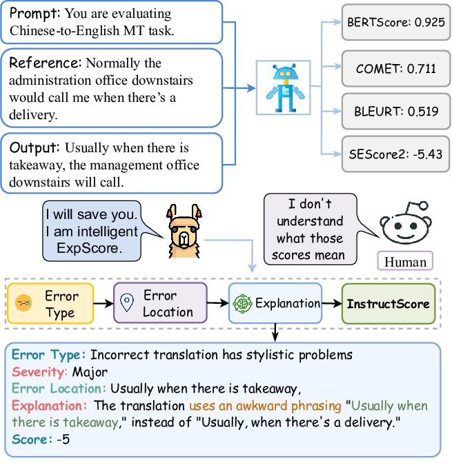
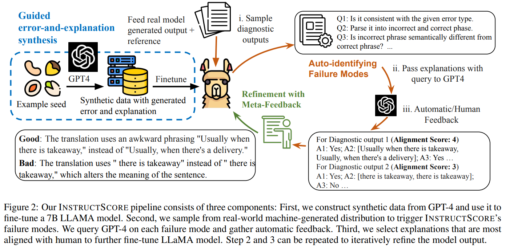
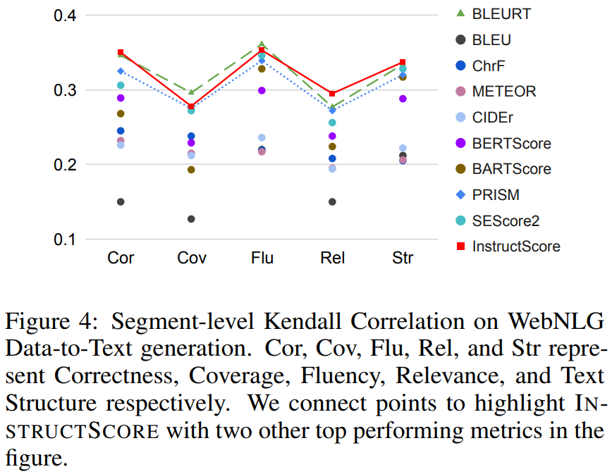

How can we more accurately and comprehensively evaluate text generation models?

Reading Time: About 10 minutes.

Paper：<https://arxiv.org/abs/2305.14282>

Code: <https://github.com/xu1998hz/InstructScore_SEScore3>

Hey adventurers,

Ever scratched your head wondering how to judge the quality of automatically generated text? How do we measure whether it truly captures the essence of what's intended? That's where INSTRUCTSCORE steps in. It’s not just another tool; it’s a groundbreaking approach to making sense of how well text generation systems are performing, providing clear feedback and insights like never before.

## INSTRUCTSCORE is Like a Human Annotator!

As we navigate the complexities of tasks like story generation, summarization, and more, the challenge of evaluation looms large. Traditional methods often leave us wanting more, lacking in clarity about how they arrive at their conclusions or failing to highlight specific areas needing attention. And while human evaluation offers depth, it comes with its own set of challenges, notably the scarcity of resources and high costs.

Enter INSTRUCTSCORE. Imagine an evaluator that not only scores text but also explains why, in a way that feels almost human. It identifies errors, categorizes them, assigns severity, and provides explanations—all without the need for expensive, time-consuming human-annotated data.

The journey to creating INSTRUCTSCORE was marked by innovative steps, from synthesizing explanations using GPT-4 to refining the model based on feedback for better accuracy. This approach has made it possible to offer detailed feedback across various domains, empowering developers to make targeted improvements and advancing the field of natural language processing.

## Diving Deeper: From Student to Master

Here's a deep dive into the genesis and evolution of INSTRUCTSCORE:

### Harnessing GPT-4's Power: 

Picture this: We use GPT-4 as the teacher to teach the student, the Exp-Generator (LLaMA), to decode the secrets of language. We start by collecting a bunch of sentences from different subjects, each with its own set of mistakes. GPT-4 then goes through these sentences, identifying the errors and explaining them. This not only builds a textbook for the Exp-Generator but also challenges it to think deeper, understand better.

But we don't stop there. To make sure INSTRUCTSCORE really understands the text and isn't just memorizing answers, we also have GPT-4 tweak the original sentences a bit. This makes our training data even more valuable, showing INSTRUCTSCORE how to deal with variations in language.

Now, it's time for INSTRUCTSCORE to hit the books. Using this dataset, it practices spotting errors, figuring out what type they are, and explaining them. We use LLaMA for this because it's great at understanding and generating text. The goal is for INSTRUCTSCORE to get really good at explaining why something in the text might be wrong, making it a top-notch evaluator.

In short, we're not just teaching INSTRUCTSCORE to recognize when text goes off track; we're training it to explain why, turning it into a smart tool for checking and improving written content.

###  Refinement with Meta-Feedback

Just like students learning through trial and error, our Exp-Generator sometimes misses the mark in its text evaluations. This is where the teacher - GPT-4, comes to rescue. It provides feedbacks on Exp-Generator's output which is then turned to alignment scores. The alignment scores are used to further fine-tune the Exp-Generator, enhancing its ability to produce accurate diagnostic reports.

Let's take a peek into INSTRUCTSCORE's journey of evolving from a student to a master through an illustrative example:

#### Initial Input to INSTRUCTSCORE:
We tasked INSTRUCTSCORE with analyzing a translation that read:
"Reference: Washing hands with air, diagnosing disease through breath, and accurately seeking for source of smog; last night, a series of creative academic achievements were awarded at the opening ceremony of the 2016 Annual Academic Conference of Zhejiang University.
Output: Wash hands with air, judge diseases, accurately search for the source of fog Yesterday evening, at the opening ceremony of the 2016 academic annual meeting of Zhejiang University, a series of academic achievements were recognized."

#### INSTRUCTSCORE's Initial Feedback:
Initially, INSTRUCTSCORE pinpointed 3 errors (we only show the last one here), identifying their nature and severity but stumbled in its explanations:
"Your Translation contains 3 errors:
...
Error type 3: Incorrect translation includes information not present in the correct translation 
Major/minor: Minor
Error location 3: "academic annual meeting"
Explanation for error 3: The incorrect translation adds the word "annual" to the phrase "academic meeting," which is not present in the correct translation. However, this does not significantly change the meaning of the sentence."

While INSTRUCTSCORE could locate errors and assess their importance, its rationale needed refinement.

#### After the Refinement:
After refinement, INSTRUCTSCORE's ability to elucidate errors took a leap forward, offering improved, precise explanations:
"Your Translation contains 3 errors:
...
Error type 3: Incorrect translation does not accurately represent the correct translation 
Major/minor: Minor
Error location 3: "academic annual meeting"
Explanation for error 3: The incorrect translation uses "academic annual meeting" instead of "academic annual confer- ence," which is a minor error that does not significantly change the meaning but will be noticed."

## Experiment

### Research Questions and Setup

Our experiments aimed to address six key research questions, focusing on INSTRUCTSCORE's performance across various tasks, domains, evaluation dimensions, unseen tasks, effectiveness in languages other than English, and alignment with human expectations. We tested INSTRUCTSCORE on tasks including machine translation (WMT22), table-to-text (WebNLG), captioning (Flicker3k), keyword-to-text (BAGEL), and commonsense text generation (Commongen). Additionally, we assessed its performance in different domains within the WMT22 task, evaluated it across various dimensions in WebNLG, and explored its capabilities in unseen tasks and languages.

### Implementation and Evaluation

We used GPT-4 as our base for implicit evaluation knowledge and LLaMA-7B for training initialization. Our data set, drawn from diverse domains, was utilized to tailor the model to specific task domains. We defined four evaluation scenarios and trained separate checkpoints for each, ensuring coverage of diverse text domains. The performance of INSTRUCTSCORE was assessed using Segment-level Kendall and Pearson correlations between human and metric outputs. Human annotators were employed to assess the alignment of our model before and after refinement, evaluating based on predefined failure mode criteria.

### Results

#### 1) What is the performance across various tasks within the English language?

For this task, we tested INSTRUCTSCORE at various tasks, including WMT22 (Machine Translation), WebNLG (Table-to-text), Flicker3k (Captioning), BAGEL (Keyword-to-text) and Commongen (Commonsense text generation). INSTRUCTSCORE showed robust performance across various tasks and domains. It significantly outperformed all other unsupervised metrics in 8 out of 9 tasks and was on par with or even surpassed some supervised metrics that trained over direct assessment data (DA). <!-- Table 5 demonstrates that INSTRUCTSCORE considerably surpasses all other unsupervised metrics in eight out of nine categories, securing the highest overall ranking. These enhancements are statistically validated through William’s pairwise significance test, with a p-value less than 0.05, underscoring their reliability. Remarkably, INSTRUCTSCORE also exceeds the performance of previously established supervised metrics that were trained using direct assessment data (DA), outperforming BLEURT20 in six out of nine categories. When compared to the GPT4 baseline, INSTRUCTSCORE shows superior performance against GEMBA-GPT4, with improvements of 0.021 in Kendall and 0.145 in Pearson correlation coefficients. The notable difference in Pearson correlation is attributed to a significant number of ties generated by GEMBA-GPT4, which may influence the accuracy of Kendall correlation results. Furthermore, INSTRUCTSCORE demonstrates competitive performance relative to supervised metrics like MATESE, COMET22, and Metric XXL, which were trained using extensive human rating data (DA and MQM), with an average gap of 0.012 in Kendall correlation and 0.045 in Pearson correlation. 

 -->

#### 2) What is the performance across different domains within the same task?

For this question, we examed our method at four diverse domains: News, Conversation, Social, and E-Commerce at WMT22. Through Kendall correlation analysis, INSTRUCTSCORE excels beyond all unsupervised metrics in four domains, with exceptions being the GPT-3.5 and GPT-4 baselines in the Chat domain. It showcases performance on par with leading supervised metrics COMET22 and Metric-XXL in the E-commerce, Chat, and Social domains. However, INSTRUCTSCORE falls short in the News domain when compared to the state-of-the-art metrics COMET22 and Metric-XXL. This discrepancy is largely due to their specialized data distribution for the News domain, derived from direct assessment (DA) and multi-dimensional quality metrics (MQM) data.

#### 3) What is the performance across different evaluation dimensions?

We evaluated INSTRUCTSCORE at five evaluation dimensions at WebNLG. Unlike the majority of metrics that provide a single score, INSTRUCTSCORE delivers a nuanced evaluation by outputting scores across multiple dimensions. Figure 4 illustrates INSTRUCTSCORE's superior performance over all unsupervised metrics across five distinct dimensions. When compared with BLEURT, which is trained on WebNLG human rating data, INSTRUCTSCORE surpasses BLEURT's best performance in three out of five evaluation dimensions. This highlights INSTRUCTSCORE's capability not only to offer a comprehensive quality score but also to facilitate a multidimensional evaluation of natural language generation tasks.

#### 4) What is the performance at unseen tasks?

Here we evaluated our method at BAGEL benchmark, a task characterized by its distinct data formats and criteria divergent from our training dataset. As illustrated in Table 5 and Figure 5, INSTRUCTSCORE, despite its unfamiliarity with the evaluation criteria specific to keyword-to-text generation, achieves higher Kendall and Pearson correlation scores than BLEURT, alongside outperforming in two out of three novel evaluation dimensions.

#### 5) Given that LLaMA is predominantly trained in English texts, can it effectively evaluate generations in other languages?

We evaluated our approach to English-to-German translations in order to investigate its multilingual evaluation capabilities. n Figure 6, INSTRUCTSCORE surpasses the majority of unsupervised metrics but falls short of the 175B GPT3.5 models and supervised metrics like COMET22 and BLEURT20 in the WMT22 English-to-German translation task. We theorize that the performance of LLaMA on non-English texts is influenced by several factors: (1) a limited amount of pretraining data, leading to less robust pretrained knowledge for languages other than English, and (2) the necessity for language alignment in tasks involving mixed-code text generation. These challenges suggest areas for future research, including the development of multilingual alignment warm-up methods prior to training on evaluation datasets 

#### 6) Can we align the diagnostic report with human expectations without requiring extensive human efforts?

The human evaluation assessed INSTRUCTSCORE's alignment both before and after self-training. INSTRUCTSCORE, following automatic critique and refinement, notably reduces the majority of global and local failure modes. Noteworthy is the more than 50% reduction in all global failure occurrences, illustrating significant enhancements in phrase alignment, error identification, and formatting consistency across the four fields. 

## The Impact and Future of INSTRUCTSCORE

INSTRUCTSCORE's introduction marks a significant milestone in natural language processing, providing a level of transparency and specificity in text evaluation that was previously unattainable. Its ability to offer detailed feedback without relying on human-annotated data means it can scale and adapt quickly, pushing the boundaries of what's possible in language generation.

As we look ahead, the journey doesn't stop here. Plans are in place to expand its capabilities, including enhancing its multilingual evaluation capacity and refining the model with advanced techniques like reinforcement learning from human feedback. The goal is clear: to continue improving INSTRUCTSCORE, making it an even more powerful tool for understanding and enhancing the art of text generation.

INSTRUCTSCORE stands as a testament to the power of AI in bridging the gap between human and machine-generated text, offering a glimpse into a future where machines not only generate text but understand its nuances deeply, akin to human insight. As we continue to explore and refine this technology, the potential for innovation in natural language processing is boundless.

## References

[1] W. Xu et al., “INSTRUCTSCORE: Towards explainable text generation evaluation with automatic feedback,” Proceedings of the 2023 Conference on Empirical Methods in Natural Language Processing, 2023. doi:10.18653/v1/2023.emnlp-main.365 

